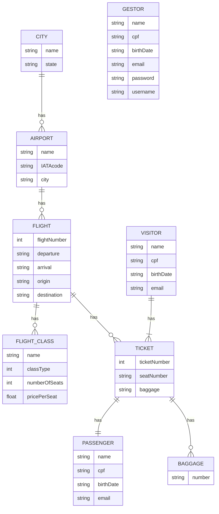

# Database  Structure

Esse é uma representação visual da estrutura do banco de dados. Lembre-se que é só uma sugestão e você é livre para alterar como bem entender.

## Tables

```mermaid
erDiagram
    FLIGHT ||--o{ FLIGHT_CLASS : has
    FLIGHT ||--o{ TICKET : has
    FLIGHT {
        int flightNumber
        string departure
        string arrival
        string origin
        string destination
    }
    FLIGHT_CLASS {
        string name
        int classType
        int numberOfSeats
        float pricePerSeat
    }
    TICKET ||--|| PASSENGER : has
    TICKET ||--o{ BAGGAGE : has
    TICKET {
        int ticketNumber
        string seatNumber
        string baggage
    }
    AIRPORT ||--o{ FLIGHT : has
    AIRPORT {
        string name
        string IATAcode
        string city
    }
    CITY ||--o{ AIRPORT : has 
    CITY {
        string name
        string state
    }
    PASSENGER {
        string name
        string cpf
        string birthDate
        string email
    }
    BAGGAGE {
        string number
    }
    VISITOR ||--|{ TICKET : has
    VISITOR {
      string name
      string cpf
      string birthDate
      string email
    }

    GESTOR {
      string name
      string cpf
      string birthDate
      string email
      string password
      string username
    }

```
